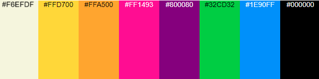

# Band Website

A responsive promotional website for a real-life rock covers band caled Tilt-Mode, designed to showcase the band’s services, introduce band members, display media content, and enable users to follow/connect with the band via its social media channels and for potential customers to book the band for live events and private functions.

## 📚 Contents

- [User Goals](#user-goals)  
- [User Stories](#user-stories)  
- [Website Goals and Objectives](#website-goals-and-objectives)  
- [Wireframes](#wireframes)  
- [Design Choices](#design-choices)  
  - [Typography](#typography)  
  - [Colour Scheme](#colour-scheme)  
  - [Images](#images)  
  - [Responsiveness](#responsiveness)  
- [Features](#features)  
  - [Existing Features](#existing-features)  
  - [Future Enhancements](#future-enhancements)  
- [Technologies Used](#technologies-used)  
  - [Languages](#languages)  
  - [Libraries & Frameworks](#libraries--frameworks)  
  - [Tools](#tools)  
- [Testing](#testing)  
  - [Bugs Fixed](#bugs-fixed)  
  - [Responsiveness Tests](#responsiveness-tests)  
  - [Code Validation](#code-validation)  
  - [User Story Testing](#user-story-testing)  
  - [Feature Testing](#feature-testing)  
  - [Accessibility Testing](#accessibility-testing)  
  - [Lighthouse Testing](#lighthouse-testing)  
  - [Browser Testing](#browser-testing)  
- [Deployment](#deployment)  
  - [To deploy the project](#to-deploy-the-project)  
  - [To fork the project](#to-fork-the-project)  
  - [To clone the project](#to-clone-the-project)  
- [Credits](#credits)

## 🎯 User Goals

- Learn about the band and its members.
- View media from live shows or recorded sessions.
- Follow the band on social media.
- Book the band for private or public events.

## 👤 User Stories

- As a **fan or potential customer**, I want to see photos, videos, and learn more about the band.
- As a **venue manager or agency**, I want to contact and book the band.
- As an **event/party planner**, I want to quickly check the band’s music style and contact the band to check price and availability.
- As a **visitor**, I want to easily navigate the site and find social links.

## 🎸 Website Goals and Objectives

- Attract more bookings through venue owners, agencies and event/party planners.
- Build band awareness and drive traffic to the band’s online platforms.
- Present media that captures the energy and appeal of the band.
- Act as a digital business card and portfolio for the band.

## 🧱 Wireframes

Wireframes were created using **Balsamiq** to plan the site layout and user experience in desktop, tablet and mobile formats.

<a href="./docs/Mobile.pdf" title="Mobile Wireframes">Mobile Wireframes</a>

<a href="./docs/Tablet.pdf" title="Tablet Wireframes">Tablet Wireframes</a>

<a href="./docs/Desktop.pdf" title="Desktop Wireframes">Desktop Wireframes</a>

## 🎨 Design Choices

### Typography

- Google Fonts were used to give the site a bold and professional feel that matches the band's energy.

#### Nav Bar and Headings

 The font family chosen for the headings, buttons and nav-bar links is <a href="https://fonts.google.com/specimen/Luckiest+Guy" title="Luckiest-Guy" rel="nofollow">Luckiest Guy</a>. 
It is a bold, sans-serif display font with a playful and retro style. Its exaggerated letterforms and strong personality make it perfect for grabbing the user's attention.

#### Body-Text

 The font family chosen for the body text is <a href="https://fonts.google.com/specimen/Inter" title="Lato" rel="nofollow">Lato</a>. It is also a sans-serif font with a rounded appearance and a modern feel. Lato also has a clean and easy-to-read style, making it suitable for both print and web design.

### Colour Scheme

- The color scheme chosen is based on the band's logo shown in the header.
- The header and footer will have a black (#00000) background to suit the rock theme of the band along with beige (#F5f5DC) for contrast.
- Other colors in the palette will be used throughout the body sections of the website to capture the fun/party theme represented by those colors, also in contrast of the black

### Images

- Sample imagery includes band members (on homepage) and event performances in a dedicated gallery section. Images are displayed in grid form with responsiveness across devices.
- There are two band logos used in the design - the first is in color and used in the header section, the second is in grey/white and used as a background image which will move vertically across when the user scrolls up and down the page.

### Responsiveness

- Bootstrap’s grid system ensures the site is fully responsive across all devices and screen sizes.

## 🧩 Features

### Existing Features

#### Header
- Contains site logo, navigation menu, and links to social media.

#### Footer
- Includes social media links and copyright.

#### Additional Sections
- Embedded Youtube promo video of band performance used in the header of the homepage in the same manner as a'hero image'.
- The Band (a bio on each band member accompanied by images - on the homepage)
- Testimonials (also on home-page)
- Gallery (photos of the band's performances - a separate page)
- Booking form (a separate page)

### Future Enhancements

- Event calendar with upcoming gig dates.
- Additional videos of band performances.

## 🛠 Technologies Used

### Languages
- HTML5  
- CSS3

### Libraries & Frameworks

### Tools
- [Balsamiq](https://balsamiq.com) (wireframes)  

## ✅ Testing

### Bugs Fixed

### Responsiveness Tests

### Code Validation

#### HTML

#### CSS

### User Story Testing

### Feature Testing

### Accessibility Testing

### Lighthouse Testing

### Browser Testing

## 🚀 Deployment

### To deploy the project

### To fork the project

### To clone the project

## 🙌 Credits