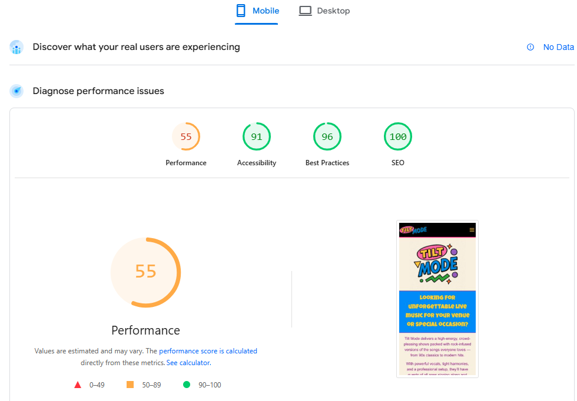

# Tilt Mode Website
[Tilt Mode](https://danrider84.github.io/tilt-mode/)

A responsive promotional website for a real-life rock covers band caled Tilt Mode, designed to showcase the band’s services, introduce band members, display media content, and enable users to follow/connect with the band via its social media channels and for potential customers to book the band for live events and private functions.

## [Contents](#contents)

- [User Goals](#user-goals)  
- [User Stories](#user-stories)  
- [Website Goals and Objectives](#website-goals-and-objectives)  
- [Wireframes](#wireframes)  
- [Design Choices](#design-choices)  
  - [Typography](#typography)  
  - [Colour Scheme](#colour-scheme)  
  - [Images](#images)  
  - [Responsiveness](#responsiveness)  
- [Features](#features)  
  - [Existing Features](#existing-features)  
  - [Future Enhancements](#future-enhancements)  
- [Technologies Used](#technologies-used)  
  - [Languages](#languages)  
  - [Libraries & Frameworks](#libraries--frameworks)  
  - [Tools](#tools)  
- [Testing](#testing)  
  - [Bugs Fixed](#bugs-fixed)  
  - [Responsiveness Tests](#responsiveness-tests)  
  - [Code Validation](#code-validation)  
  - [User Story Testing](#user-story-testing)  
  - [Feature Testing](#feature-testing)  
  - [Accessibility Testing](#accessibility-testing)  
  - [Lighthouse Testing](#lighthouse-testing)  
  - [Browser Testing](#browser-testing)  
- [Deployment](#deployment)  
  - [To deploy the project](#to-deploy-the-project)  
  - [To fork the project](#to-fork-the-project)  
  - [To clone the project](#to-clone-the-project)  
- [Credits](#credits)

## User Goals

- User friendly navigation.
- Site works well on all devices.
- Easy mechanism for contacting/booking the band.
- Access to band information and media.
- Connect with band via social media.

## User Stories

- As a user I want to learn more about the band and its members.
- As a user, I want to see the band’s photos and videos.
- As a user, I want to be able to connect with the band via social media.
- As a user, I need to be able to book the band for an event with ease.
- As a user, I want to be able to contact the band with queries or special requests.
- As a user, I want to be able to use website on range of devices.
- As a user, I want navigation to be intuitive.
- As a user, I want the content to be accessible for anyone with diverse needs.

## Website Goals and Objectives

- Attract more bookings through venue owners, agencies and event/party planners.
- Build band awareness and drive traffic to the band’s online platforms.
- Present media that captures the energy and appeal of the band.
- Act as a digital business card and portfolio for the band.

## Wireframes

Wireframes were created using **Balsamiq** to plan the site layout and user experience in desktop, tablet and mobile formats.

<a href="./docs/Mobile.pdf" title="Mobile Wireframes">Mobile Wireframes</a>

<a href="./docs/Tablet.pdf" title="Tablet Wireframes">Tablet Wireframes</a>

<a href="./docs/Desktop.pdf" title="Desktop Wireframes">Desktop Wireframes</a>

## Design Choices

### Typography

- Google Fonts were used to give the site a bold and professional feel that matches the band's energy.

#### Nav Bar and Headings

 The font family chosen for the headings, buttons and nav-bar links is <a href="https://fonts.google.com/specimen/Luckiest+Guy" title="Luckiest-Guy" rel="nofollow">Luckiest Guy</a>. 
It is a bold, sans-serif display font with a playful and retro style. Its exaggerated letterforms and strong personality make it perfect for grabbing the user's attention.

#### Body-Text

 The font family chosen for the body text is <a href="https://fonts.google.com/specimen/Inter" title="Lato" rel="nofollow">Lato</a>. It is also a sans-serif font with a rounded appearance and a modern feel. Lato also has a clean and easy-to-read style, making it suitable for both print and web design.

### Colour Scheme

- The color scheme chosen is based on the band's logo shown in the header.
- The header and footer will have a black (#00000) background to suit the rock theme of the band.
- Other colors in the palette will be used throughout the website to capture the 90s retro fun/party theme represented by those colors, also in contrast of the black.

### Images

- Sample imagery includes a picture of the whole band along with individual band member photos  displayed in grid form with responsiveness across devices.
- The band logo is used as a hero image and the navigation bar contains a separate image which consitsts of an extract of text from the bands logo showing the band's name.
- All images/graphic provided by the band have been obtained directly from Tilt Mode and used with their permission.

### Responsiveness
- Bootstrap’s grid system ensures the site is fully responsive across all devices and screen sizes. A mobile first approach was taken, with adjustments necessary for medium, large and extra-large devices.
- Media query used for mobile screens to ensure each page sections appears below the collapsable navbar when selected.
- The breakpoints I am using are from Bootstrap (Medium: =>768px Large: =>992px Extra large: =>1200px).

## Features
Layout is easy to use and adheres to the best practices in formatting and styling. Users can easily navigate between sections and have quick and easy access to the contact/booking section to book or raise a query with the band.
### Existing Features

#### Navbar
The navbar was created using Bootstrap classes. It contains:
- the band's name using graphics from the band's logo to spell out 'Tilt Mode' of left of navbar, which also navigates back to the home section when clicked on.
- headings/links to each section as well as a CTA booking button (link to the booking form) on the right of navbar.
At mobile screen size, a toggler appears on the right of the navbar and the collapsable menu containing the section links appears on the left of the sceen. The nooking button and navbar links have a separate contrast of colours when hovered over/selected. 

#### Header
- Contains the band's logo as a hero image, followed by a band bio.

#### Footer
- Contains social media links using icons from Favicon styled using colours from the pallette and a copyright disclaimer.

#### Additional Sections
- The Band: a section containing band images and details of the band members.
- What we Provide: a section with details of the band's services.
- Booking form.
- Success page.

### Future Enhancements

- Event calendar with upcoming gig dates.
- Photo & video gallery.
- Setlist examples.
- Audio recordings of band performances.
- Embedded Youtube promo video of band performance - potentially below hero image.
- Testimonials section.

## Technologies Used

### Languages
- HTML  
- CSS

### Libraries & Frameworks
- Bootstrap
- Google Fonts
- Font Awesome
- Favicon
- WSC.com (SVGs)

### Tools
- [Balsamiq](https://balsamiq.com) (wireframes)
- [GitHub](https://github.com)
- [W3C HTML Validation Service](https://validator.w3.org)
- [W3C CSS Validation Service](https://jigsaw.w3.org/css-validator)

## Testing

### Bugs Fixed

| Bug                            | Status | Description                                              | Steps to Resolve                                                                 |
|--------------------------------|--------|----------------------------------------------------------|----------------------------------------------------------------------------------|
| Style not applied to classes   | Fixed  | CSS styles weren't applying due to selector mismatch     | Used HTML validator to identify incorrect class usage; corrected selectors      |
| Button hover not working       | Fixed  | Buttons didn't react on hover/click                      | Removed space in button: hover selector after CSS validation                   |
| Sections misaligned/overflow  | Fixed  | Layout issues with vertical alignment and overflow       | Fixed Bootstrap grid nesting with validator and ChatGPT guidance                |
| Nav menu hugging screen edge  | Fixed  | Nav items were too close to screen edge on mobile        | Added Bootstrap container and adjusted padding for spacing                      |
| Collapsible menu not closing  | Fixed  | Navbar didn’t auto-collapse after clicking a link        | Added JS script to close collapse on link click                                 |
| Contact form not submitting   | Fixed  | Submit button didn’t trigger action                      | Reviewed form setup and ensured correct name, method, and action values   |
| Image not scaling on mobile   | Fixed  | Band photos overflowed on small screens                  | Added responsive Bootstrap classes (img-fluid)                                |

### Responsiveness Tests

## Responsive Design Test Results
To test the responsiveness, I followed the mobile-first strategy and verified all of my modifications using the DevTools browsers for Google Chrome. Deployed versions were tested using the external website [Responsive Design Checker](https://responsivedesignchecker.com/).

| Size | Device Example         | Navigation | Element Alignments | Content Placement | Functionality |
|------|------------------------|------------|---------------------|-------------------|---------------|
| sm   | iPhone 11 Pro          | Good       | Good                | Good              | Good          |
| md   | iPad Mini              | Good       | Good                | Good              | Good          |
| lg   | iPad Pro               | Good       | Good                | Good              | Good          |
| xl   | Asus Vivobook Laptop   | Good       | Good                | Good              | Good          |
| xxl  | Desktop                | Good       | Good                | Good              | Good          |

### Code Validation

#### HTML
I have used [W3C CSS Validation Service](https://jigsaw.w3.org/css-validator) to test 2 html files. The test for the index.html file initially came back with a series of errors that were addressed, before relevant code was re-used for the Success page.
- Index.html [Initial test](/docs/html-validator-results)
- Index.html [Final test](/docs/html-validator-index.png)

- [Success.html](/docs/html-validator-success)

#### CSS
- [style.css](/docs/css-validator-success)

### User Story Testing
- [Evidence #1](/docs/user-story-testing-evidence-1.pdf)
- [Evidence #2](/docs/user-story-testing-evidence-2.pdf)
- [Evidence #3](/docs/user-story-testing-evidence-3.pdf)

| User Story                                                                 | Result                                                                                                                                             | Pass |
|----------------------------------------------------------------------------|----------------------------------------------------------------------------------------------------------------------------------------------------|------|
| As a user I want to learn more about the band and its members.            | The 'Home', ‘The Band’ and 'Contact' sections provide information on the band and its members.                                                  | Yes  |
| As a user, I want to see the band’s photos and videos.                    | ‘The Band’ section provides photos of the band together and individually. There is a YouTube link in the footer for access to band videos.        | Yes  |
| As a user, I want to be able to connect with the band via social media.   | The footer provides social media links.                                                                                                            | Yes  |
| As a user, I need to be able to book the band for an event with ease.     | There is a booking form that is easy to complete.                                                                                                  | Yes  |
| As a user, I want to be able to contact the band with queries or special requests. | There is a contact section, whereby the enquiry form can be used to raise queries.                                                                 | Yes  |
| As a user, I want to be able to use the website on a range of devices.    | Website is fully functional on all devices.                                                                                                        | Yes  |
| As a user, I want navigation to be intuitive.                             | All sections can be accessed with ease from a single page and navbar links which remain visible at all times.                                     | Yes  |
| As a user, I want the content to be accessible for anyone with diverse needs. | Passed all accessibility tests.                                                                                                                    | Yes  |

### Feature Testing
This website was extensively tested for functionality using Chrome Edge developer tools throughout the development process.

### Accessibility Testing
I have used web accessibility evaluation tool [WAVE Tool](https://wave.webaim.org/) which helps to determine if web content is accessible to individuals with diverse needs. All features passed, with exception for 29 contrast errors having been identified with the text used throughout the website. No further action was taken, as there were all light colours (gold/cream) against darker colours (purple and blue).
!(/documents/wave.png)

### Lighthouse Testing
The Tilt Mode website has been tested in the Chrome Dev Tools tools using Lighthouse Testing tool which inspects and scores the website for the following criteria:
- Performance - how quickly a website loads and how quickly users can access it.
- Accessibility - test analyses how well people who use assistive technologies can use your website.
- Best Practices - checks whether the page is built on the modern standards of web development.
- SEO - checks if the website is optimised for search engine result rankings.

### Browser Testing
The Tilt Mode website was examined for bugs and malfunctions using Google Chrome and selected for further testing.

## Deployment

### To deploy the project
The Tilt-Mode website was deployed to GitHub pages via the following steps:
- Navigate to the repository on GitHub and click on Settings.
- In the side navigation and select Pages.
- In the None dropdown and choose Main.
- Click on the Save button.
- The website is now live at https://danrider84.github.io/tilt-mode/.

### To fork the project
Forking the GitHub repository allows you to create a duplicate of a local repository. This is done so that modifications to the copy can be performed without compromising the original repository.

- Log in to GitHub.
- Locate the repository.
- Click to open it.
- The fork button is located on the right side of the repository menu.
- To copy the repository to your GitHub account, click the button.

### To clone the project
- Log in to GitHub.
- Navigate to the main page of the repository and click Code.
- Copy the URL for the repository.
- Open your local IDE.
- Change the current working directory to the location where you want the cloned directory.
- Type git clone, and then paste the URL you copied earlier.
- Press Enter to create your local clone.

## Credits
- Simen Dahlin - reviewer
- Tilt Mode - use of band member names and photos